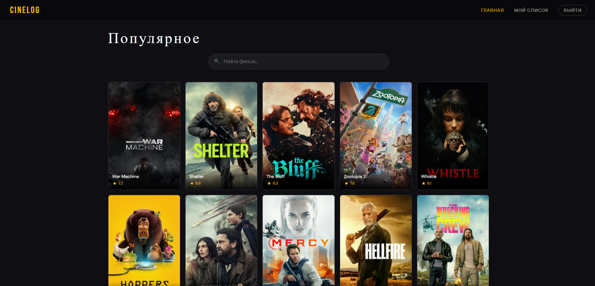

# 🎬 CineLog

Личный трекер фильмов на React. Можно найти необходимый фильм, просмотреть его описание и добавить в список просмотров.

🌐 **[Открыть сайт](https://dzzau.github.io/cinelog/)**

## Скриншот



## Технологии

- **React 19** — UI библиотека
- **React Router v7** — роутинг
- **Zustand** — стейт-менеджмент
- **Axios** — HTTP запросы
- **Tailwind CSS v4** — стили
- **Vite** — сборщик
- **TMDB API** — база данных фильмов

## Функциональность

- Поиск фильмов с дебаунсом
- Детальная страница каждого фильма
- Личный список просмотров
- Сохранение списка в localStorage
- Защищённые роуты (ProtectedRoute)
- Lazy loading страниц

## React концепции в проекте

| Концепция | Где используется |
|-----------|-----------------|
| `useState` | Поиск, авторизация |
| `useEffect` | Загрузка данных, дебаунс |
| `useRef` | Автофокус на поиск |
| `useContext` | Тема приложения |
| `useParams` | ID фильма из URL |
| `useNavigate` | Навигация назад |
| `React.memo` | Оптимизация MovieCard |
| `lazy + Suspense` | Lazy loading страниц |
| `Zustand` | Глобальный стейт watchlist |
| `Custom Hook` | useMovieSearch с дебаунсом |
| `ProtectedRoute` | Защита страницы watchlist |

## Запуск локально
```bash
git clone https://github.com/Dzzau/cinelog.git
cd cinelog
npm install
```

Создай файл `.env`:
```
VITE_TMDB_TOKEN=твой_токен
VITE_TMDB_BASE_URL=https://api.themoviedb.org/3
```
```bash
npm run dev
```

## Автор

Melnikova Dana
